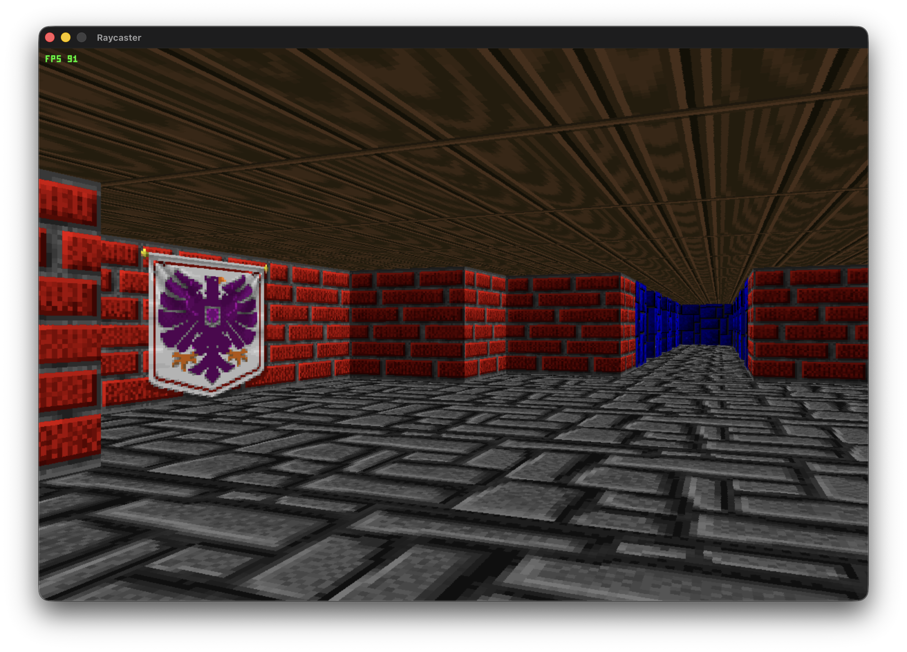
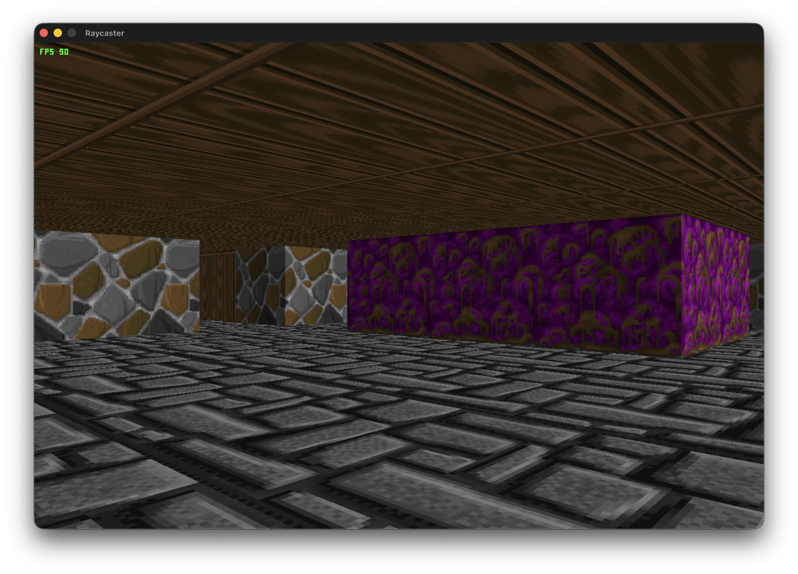

# Raycaster (Work In Progress)

A C++20 software raycaster engine built from scratch using SDL2 and `stb_image`.

> Note: This project is currently a Work In Progress (WIP).

## Overview

This project implements a pseudo-3D rendering engine similar to Wolfenstein 3D. Instead of using GPU graphics APIs (OpenGL, DirectX, Vulkan), it renders 3D perspectives on 2D grid maps directly on the CPU using raycasting.

For every column of pixels on the screen, a ray is cast from the player's view plane into the 2D grid map. The engine uses Digital Differential Analysis (DDA) to calculate exact wall intersections, computes perpendicular wall distances to prevent fisheye distortion, samples texture coordinates, and streams the rasterized frame into a 32-bit ARGB pixel buffer.

## Features

- DDA grid traversal algorithm for fast wall hit detection
- Dynamic PNG texture loading (64x64 Wolfenstein wall textures) using `stb_image`
- Procedural fallback texture generation
- Wall shading for directional depth (darker side walls)
- Custom low-bit 3x5 bitmap font renderer for real-time FPS display
- Software rasterized frame buffer streaming via SDL2

## Dependencies

- C++20 compiler
- CMake 3.20+
- SDL2

## Build Instructions

```bash
cmake -B build
cmake --build build
```

Run executable:

```bash
./build/Raycaster
```

## Controls

- `W` / `S`: Move forward / backward
- `A` / `D`: Rotate left / right
- `ESC`: Exit

## Screenshots

### Wolfenstein Textures


